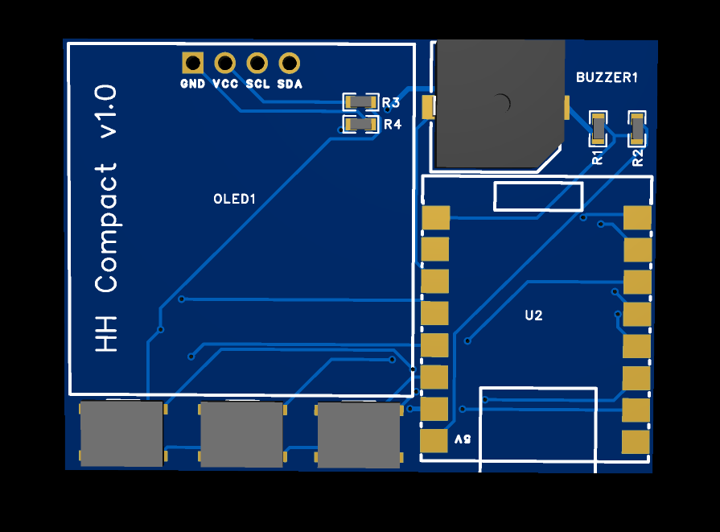
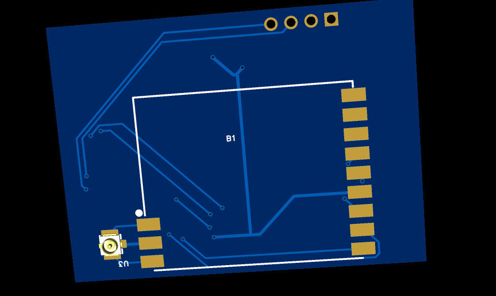

# Compact 1.0

Compact PCB design for [Hertz Hunter](https://github.com/odddollar/Hertz-hunter) by Kreviuz.

    

    

### Description

This is an experimental compact version I created based on my full-size design. I've only tested the full-size version, but this should work without any issues.

The display is any 0.96" I2C OLED from AliExpress, with the default pinout `GND VCC SCL SDA`. If your display's pinout is `VCC GND SCL SDA`, you can swap `VCC` and `GND` by changing the alignment of `R3` and `R4`.

> [!IMPORTANT]
>
> This design is powered by the ESP32's USB-C port, not a built-in battery. Battery voltage monitoring circuitry is included, but it's tied to the ESP32's 5v output and can therefore be disabled when flashing the firmware by following [these instructions](https://github.com/odddollar/Hertz-hunter/blob/master/SOFTWARE.md#5-if-necessary-disable-battery-monitoring).
