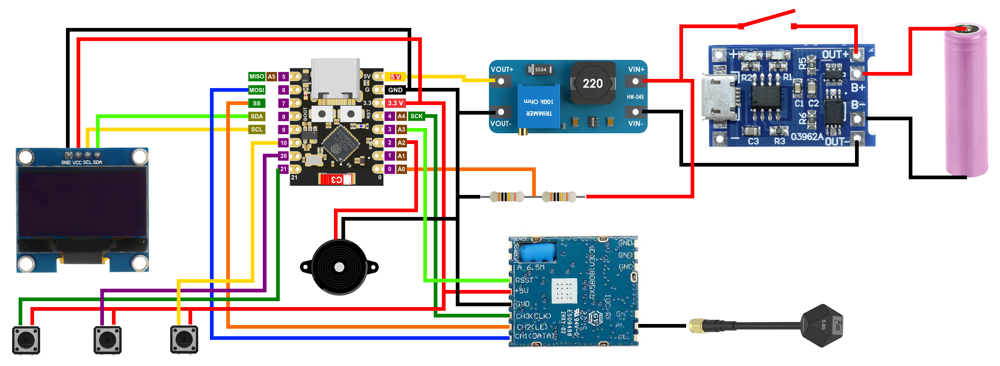

# DIY

The original hardware design for [Hertz Hunter](https://github.com/odddollar/Hertz-hunter).

    

### Components

These components can be connected together on a bread-board or soldered more permanently onto some type of perf-board. All prices are in Australian dollars (AUD).

- 1x [ESP32-C3 Super Mini](https://www.aliexpress.com/w/wholesale-esp32-c3-super-mini.html) (<$5)
- 1x [RX5808 with SPI mod](https://www.aliexpress.com/w/wholesale-rx5808-spi.html) (\$25 to \$50 depending on the seller)
- 1x [1.3" I2C 128x64 OLED](https://www.aliexpress.com/w/wholesale-1.3-oled.html) (<$5)
  - I use an OLED with the SH1106 controller chip, but the SSD1306 chip *should* work as well. The modifications that need to be made to the source code are explained at the end of [Firmware setup](#firmware-setup)
- 1x [Active 3.3V buzzer](https://www.aliexpress.com/w/wholesale-active-buzzer.html) (<$3)
- 1x [TP4056 lithium battery charger module](https://zaitronics.com.au/products/tp4056-type-c-18650-lithium-battery-charger-protection) (<$2)
- 1x [5V boost converter](https://zaitronics.com.au/products/mt3608-step-up-module) (<$3)
  - If using an adjustable boost converter, set the output to 5V using a multimeter. Lock the potentiometer in place with a dab of super glue
- 3x Momentary buttons
- 2x 100kΩ resistors
- 1x Power switch
- 1x Li-ion/Li-po cell
- 1x 5.8GHz antenna
  - I've used a U.FL to SMA pigtail so I can connect an external antenna

### Wiring

    

