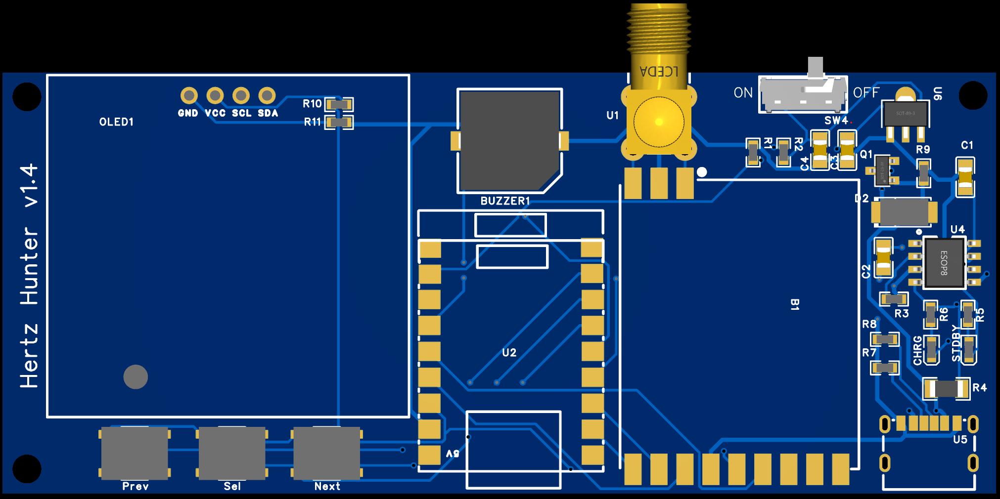
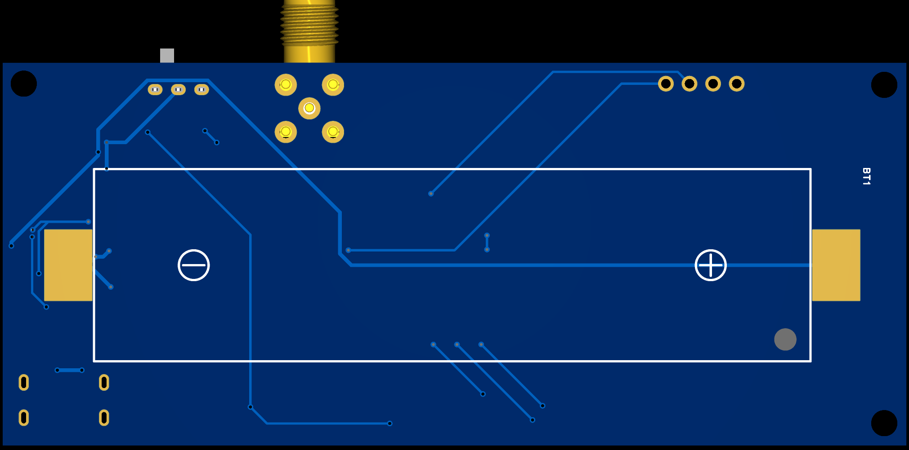

# HertzHunter PCB 1.4

Compact PCB design for [Hertz Hunter](https://github.com/odddollar/Hertz-Hunter) by Kreviuz.

    

    

### Description

This is the full-size version of my board.
Tested by me.
The additional USB port is for charging only. The PCB will be powered via USB when charging and can also be turned off and on while charging. You cannot charge the battery from the ESP32 USB port.

The display is any 1.3" I2C OLED from AliExpress, with the default pinout `GND VCC SCL SDA`. If your display's pinout is `VCC GND SCL SDA`, you can swap `VCC` and `GND` by changing the alignment of `R10` and `R11`.

The design is inspired by NuclearQuads' NuclearCounter (just the design, don't know if schematic is similar or not)

> [!IMPORTANT]
>
> When the ESP32 is plugged into USB without a battery, the PCB will work, but battery voltage monitoring will report 2.8V. Battery voltage monitoring can be disabled when flashing the firmware by following [these instructions](https://github.com/odddollar/Hertz-Hunter/blob/master/SOFTWARE.md#5-if-necessary-disable-battery-monitoring).
