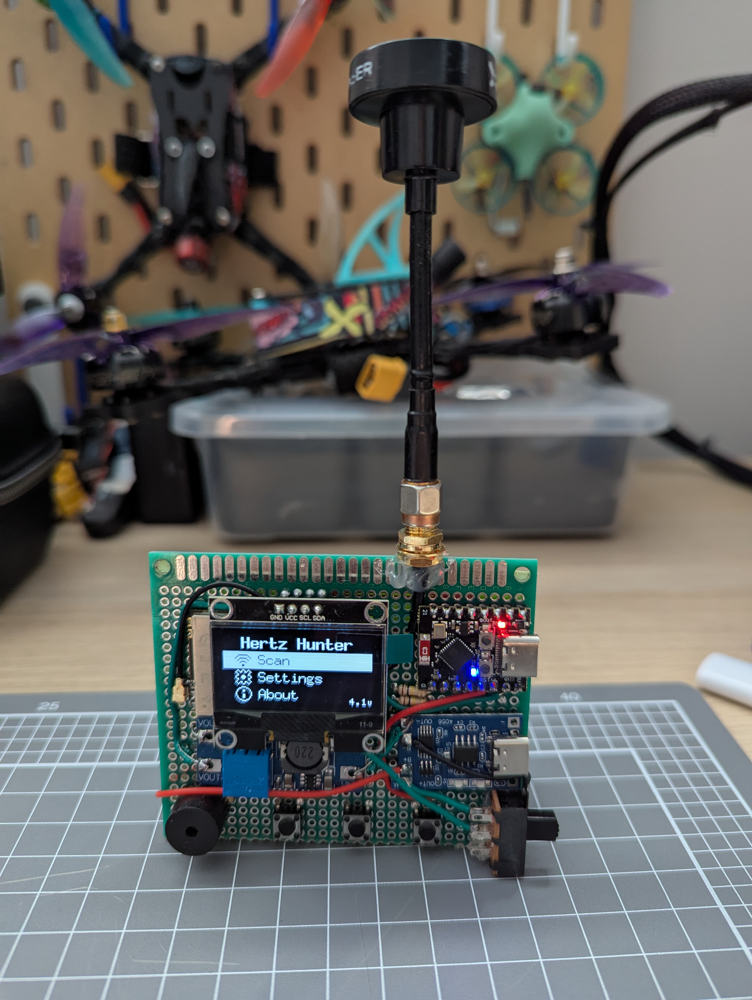

# Hertz Hunter Hardware

Repository of different hardware designs for the [Hertz Hunter](https://github.com/odddollar/Hertz-hunter) RF spectrum analyser.

## Designs

### DIY

[Link](./DIY)

- **Designer**: Simon Eason (odddollar)
- **Designer contact**: Create an issue/pull request in this or Hertz Hunter's [repo](https://github.com/odddollar/Hertz-hunter)
- **Open source**: Yes

<div align="center">
    
</div>


## Adding your own design

Adding your own design to this repository is encouraged! **Your design does not have be open source.**

1. Fork this repo and clone it down
2. Create a folder with your design's name
3. Create a `README.md` within the folder containing information about your design, such as how to build and use it, any features it may offer, etc.
4. Place any required images, bill of materials, schematics, gerber files, etc. into that folder
5. Fill out the below template and add it **the repo's main `README.md`**
6. Submit a pull request to have your changes merged into the main repo

### Template

Please use the following template to add your design's entry to this `README.md`. No fields are mandatory, however please include at least a designer name/username and, if possible, an example image. Add any additional fields you would like to include, keeping the formatting consistent.

An example is provided above with the entry for the DIY design.

```markdown
### Design name

[Link](./link to design's folder within this repo)

- **Designer**: 
- **Designer contact**: 
- **Open source**: 
- **Purchase/external link**: 
- **Price**: 

<div align="center">
    
</div>
```

